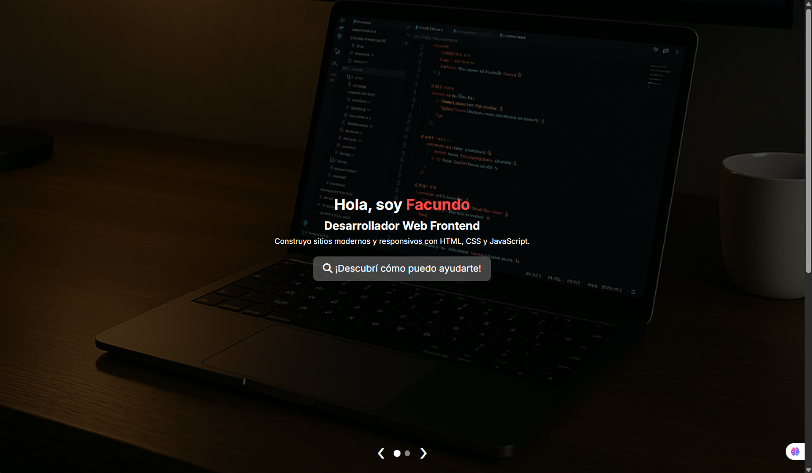
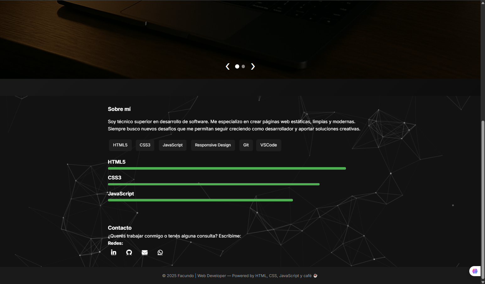

# Portfolio | Facundo López

Este es mi sitio web personal, un **portfolio** estático y moderno que muestra quién soy, mis habilidades y la forma de contactarme.  
Está construido con:

- **HTML5** y **CSS3** para la estructura y estilos
- **JavaScript** para animaciones (slider, barras de progreso, scroll suave)
- **particles.js** para fondo interactivo
- **AOS** para animaciones al hacer scroll




## 🚀 Características

1. **Modo oscuro** con tarjetas semitransparentes y efecto _glassmorphism_  
2. **Slider** de bienvenida con controles manuales y automático  
3. **Sección “Sobre mí”** con animación de habilidades y barras de progreso  
4. **Formulario de contacto** simplificado vía `mailto:` + enlaces a LinkedIn, GitHub y WhatsApp  
5. **Despliegue automático** en Netlify/Vercel al hacer push a `main`

## 📦 Cómo ejecutar localmente

```bash
# Clona el repositorio
git clone https://github.com/USER/portfolio-facundo.git

# Entra a la carpeta
cd portfolio-facundo

# Abre index.html en tu navegador
open index.html   # o simplemente haz doble clic en el archivo
